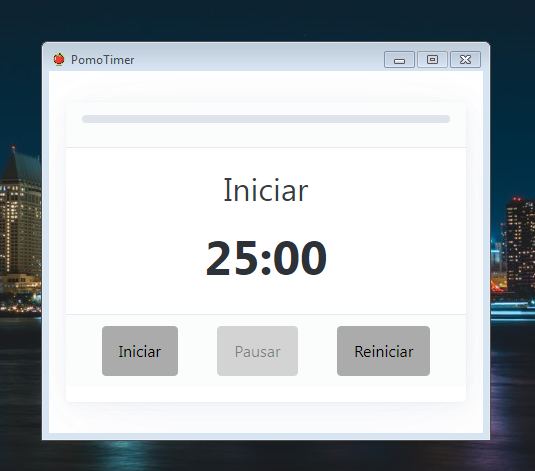

# PomoTimer

PomoTimer es una herramienta de gestión del tiempo basada en la técnica de Pomodoro, que ayuda a aumentar la productividad y mantener el enfoque durante las tareas

## Características

- Altamente minimalista, sin elementos visuales molestos.
- Notificaciones de sonido suaves que no molestan.
- Portable, no necesita instalacion

## Capturas de Pantalla

## Requisitos del Sistema

- [Requisito 1]
- [Requisito 2]
- [Requisito 3]
- ...

## Instalación

Simplemente dirijase a la pagina de Releases y descargue la version mas reciente compatible con su equipo.

<!-- ## Contribución

- Si deseas contribuir a este proyecto, sigue estos pasos:
  1. Haz un fork de este repositorio.
  2. Crea una rama con tu nueva función (`git checkout -b feature/nueva-funcion`).
  3. Realiza los cambios y realiza commit de ellos (`git commit -m 'Agrega nueva función'`).
  4. Haz push de la rama (`git push origin feature/nueva-funcion`).
  5. Abre una Pull Request en este repositorio.

## Licencia

[Indica la licencia que deseas utilizar para tu aplicación] -->

## Contacto

- Autor: [Eliezer516]
- Sitio web: [https://eliezer516.github.io]